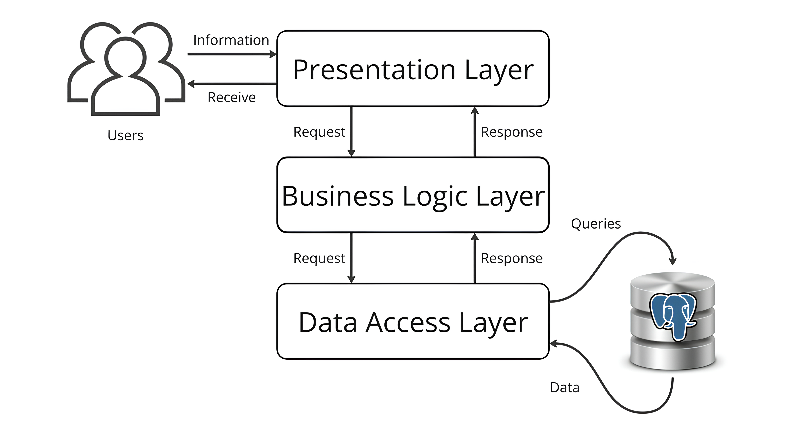

# DorZnakUA RESTful Web API

## 📌 About the Project

**DorZnakUA** is a `REST API` for **calculating the quantity of road signs on road sections**.  
The project enables **precise engineering calculations**, **speeds up the estimation process**, and generates a **comprehensive project report**.

✅ **Key Features:**
- **CRUD functionality** (`Create`, `Read`, `Update`, `Delete`)
- **Fast and accurate sign quantity calculation**
- **Automated report generation**
- **Authorization:** `JWT Bearer`
- **API Documentation:** `Swagger`



---  

## ⚙️ Technology Stack

- **Programming languages:** `C#`
- **SDK:** `.NET 8`
- **Frameworks:** `ASP.NET Core Web API` (RESTful API)
- **Persistence:**
  - **Database:** `PostgreSQL`
  - **ORM:** `Entity Framework Core 8.0`
- **Object Mapping:** `AutoMapper`
- **Validation:** `FluentValidation`
- **Logging:** `Serilog`
- **Testing:** `xUnit`, `Moq`
- **Tools & IDE:** `Rider`, `Visual Studio`, `Postman`

---  

## 💻 Development Environment

- **.NET SDK:** `.NET 8.0.101`
- **Check installed SDK version:**
  ```sh
  dotnet --version